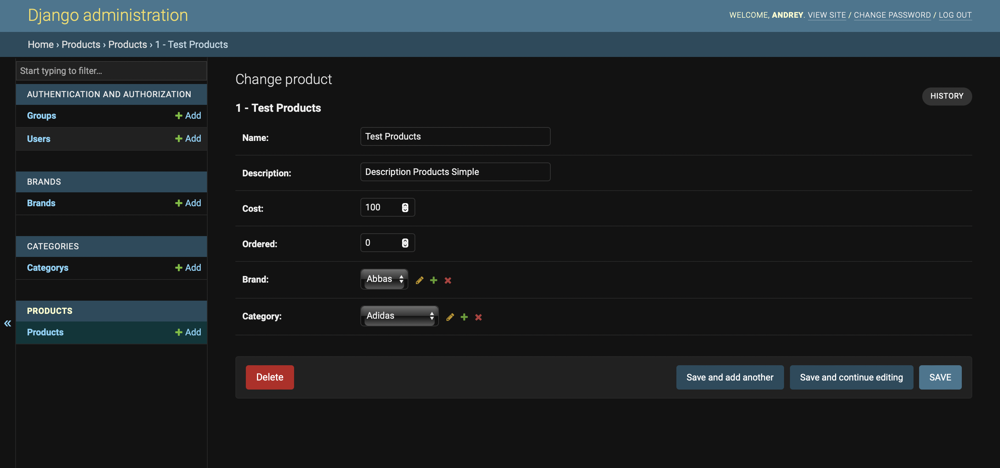
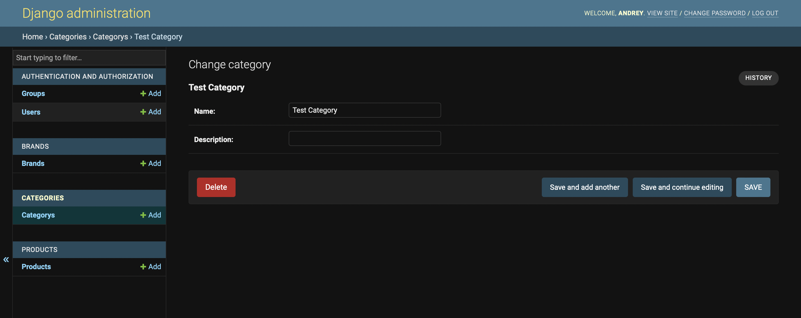
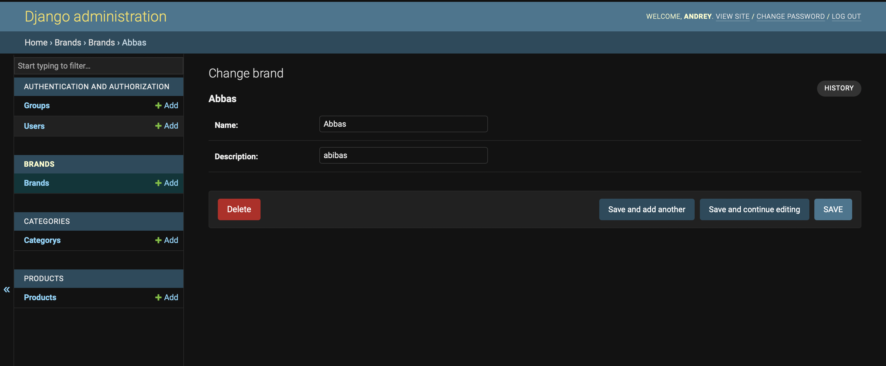
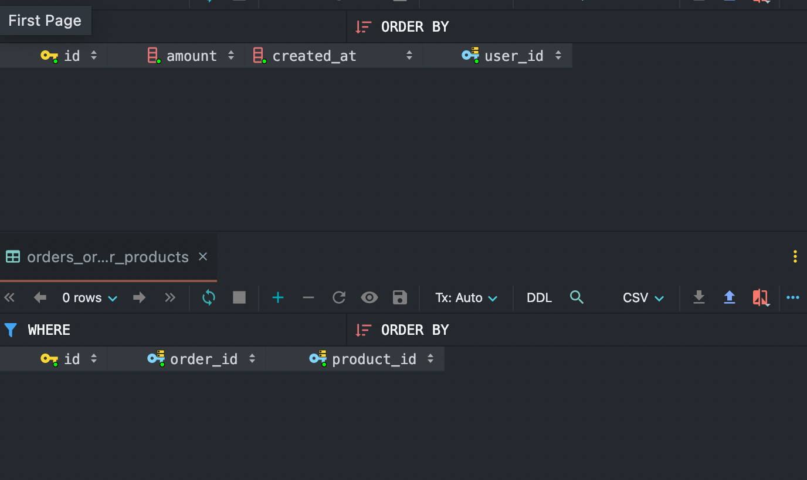

# Урок 5 - Работа с Моделями и миграциями

### Цель:
* Создать новые модуля с моделями для базы данных
* Научится понимать где и какие связи стоит принимать
* Создать связи `Многие-ко-Многим`, `Один-к-Одному`, `Один-ко-Многим`

### Задачи:
* Для модели `Product` создайте связи с моделями `Brand`, `Category` (`one-to-many`, many brands/categories has one product)
Product:
  * `brand_id`
  * `category_id`
* Создайте модель Customer (заказчики)
  * `id`: int
  * `name`: String
  * `email`: String, unique
* Создайте модель Order (заказы)
  * `id`: int 
  * `customer_id`: User (Заказчик)
  * `amount`: Int (Общая стоимость)
  * `created_at`: Datetime (Дата заказа)
* Для модели `Order` и `Product` создайте связь многие ко многим (Товары в заказе)

### Примеры полей таблиц в административной панели
1. Товар, связь с категориями и брендом

2. Категория
  

3. Бренды

4. Таблицы со связями для заказов

### Документация
1. Один к одному - https://docs.djangoproject.com/en/4.0/topics/db/examples/one_to_one/
2. Один ко многим - https://docs.djangoproject.com/en/4.0/topics/db/examples/many_to_one/
3. Многие ко многим - https://docs.djangoproject.com/en/4.0/topics/db/examples/many_to_many/